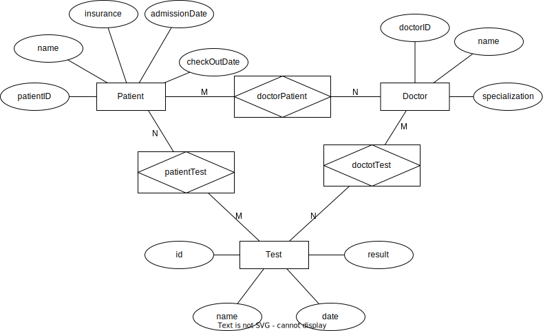
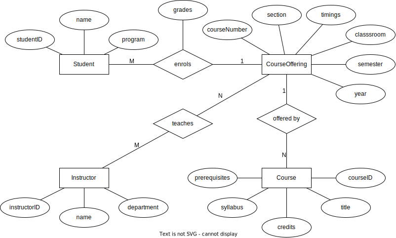

1. Suppose you are given the following requirements for a simple database for the National Hockey League (NHL): the NHL has many teams, 
    - each team has a name, a city, a coach, a captain, and a set of players, 
    - each player belongs to only one team, 
    - each player has a name, a position (such as left wing or goalie), a skill level, and a set of injury records, 
    - a team captain is also a player, 
    - a game is played between two teams (referred to as host_team and guest_team) and has a date (such as May 11th, 1999) and a score (such as 4 to 2). 

    Construct a clean and concise ER diagram for the NHL database using the Chen notation as in your textbook. List your assumptions and clearly indicate the cardinality mappings as well as any role indicators in your ER diagram.
      
    **ER diagram**
  
    
    
---
2. Construct an E-R diagram for a car-insurance company whose customers own one or more cars each. Each car has associated with it zero to any number of recorded accidents
        
    **ER diagram**
    
    
        
---
3. Construct an E-R diagram for a hospital with a set of patients and a set of medical doctors. Associate with each patient a log of the various tests and examinations conducted.

    **ER diagram**
    
    
    
---
4. A university registrar’s office maintains data about the following entities: 
    - courses, including number, title, credits, syllabus, and prerequisites; 
    - course offerings, including course number, year, semester, section number, instructor(s), timings, and classroom; 
    - students, including student-id, name, and program; and 
    - instructors, including identification number, name, department, and title. 
    
    Further, the enrollment of students in courses and grades awarded to students in each course they are enrolled for must be appropriately modeled. Construct an E-R diagram forthe registrar’s office. Document all assumptions that you make about the mapping constraints.
    
    **ER diagram**
    
    
